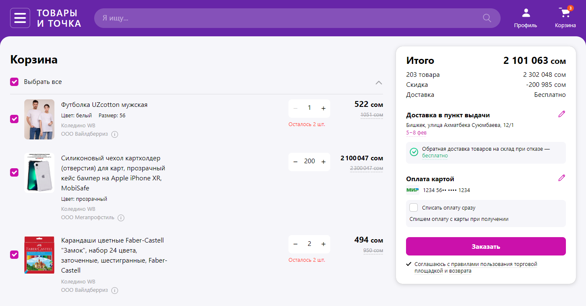

# Wildberries - L0 | Basket Page

Проект верстки страницы корзины интернет-магазина в рамках стажировки.

  

## Функционал
- Выбор товаров для покупки
- Добвление товаров в избранное
- Изменение способов оплаты и адреса доставки
- Удаление товаров
- Добавил изменение окончания слова 'товаров' в сайдбаре в зависимости от падежа.
- Возможность увеличить количество каждолго продукта
- Добавил небольшой функционал и стилизацию для формы поиска
- Валидация формы заполнения данных пользователя
- Адаптивная верстка
- Возможность выбрать пункт выдачи или адрес курьерской доставки
- Все данные товаров и адресов доставки находятся в файле data.js
- Добавлен авто скролл к форме в случае ошибок валидации

## Демонстрация
Можете ознакомиться тут - [DEPLOY](https://wb-basket.netlify.app/)
